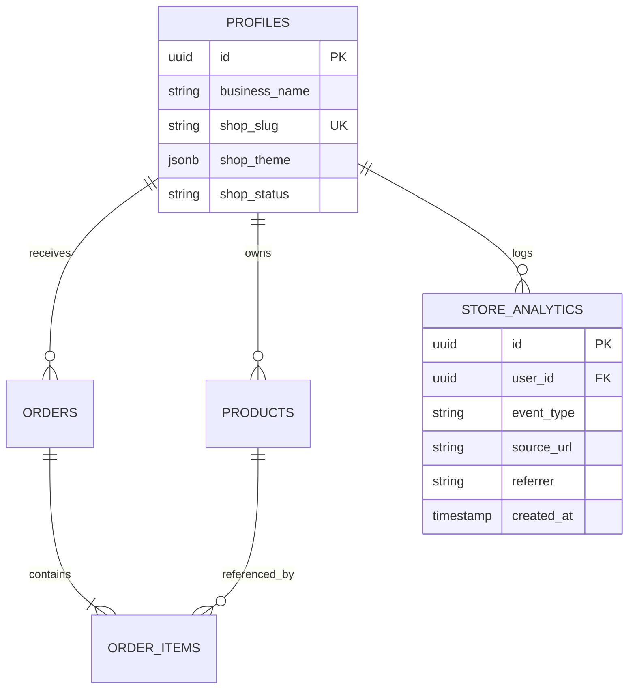

# PRODUCT AUDIT & RESTRUCTURE REPORT: RESELLERPRO
**Document Version:** 1.0.0  
**Prepared by:** Senior SaaS Product Architect, UX Strategist, & Full-Stack Engineer  
**Target Path:** `product-audit-report.md`  

---

## EXECUTIVE SUMMARY

ResellerPro is transitioning from a **CRM-centric tool** (manually logging WhatsApp/Instagram orders via copy-paste parsing) to a **Store-First, CRM-Second Operating System** for social sellers.

```
OLD WORKFLOW (Manual, High Friction, Non-Scalable):
Customer ──> WhatsApp/Insta Chat ──> Seller copies text ──> Smart Paste ──> CRM ──> Order logged

NEW WORKFLOW (Automated, Frictionless, Scalable):
Seller shares Link (resellerpro.in/fashionhub) ──> Customer browses ──> Checkout ──> Order auto-created in CRM ──> Seller clicks "Confirm via WhatsApp"
```

This report analyzes the current codebase, maps the structural gaps, details database migrations, designs the new visual dashboard/storefront, proposes SaaS growth loops to acquire the first 100 active sellers, and sets out a clear engineering roadmap.

---

## SECTION 1: Current Product Analysis

### 1.1 Technical Stack & Architecture
* **Frontend/Core**: Next.js 14 (App Router) with React 18, utilizing server components for dynamic routing and client-side code for forms and charts.
* **Styling**: Tailwind CSS with Radix UI (shadcn/ui primitives), utilizing CSS variables for theme modes (Theme toggles implemented).
* **Database & Auth**: Supabase (PostgreSQL) with Row Level Security (RLS) enabled across tables. Authentication uses Supabase OTP (`auth_otps` table and mail logs).
* **Client State**: Zustand for local state management (e.g., carts, UI states).
* **Server State**: React Query (`@tanstack/react-query`) for optimistic rendering of lists.
* **Payments**: Razorpay Node SDK (`razorpay`) and checkout scripts.

### 1.2 User Flow & Navigation Audit
* **Sidebar (`Sidebar.tsx`)**: Nav items are hardcoded to `Dashboard`, `Enquiries`, `Products`, `Customers`, `Orders`, `Analytics`, `Settings`.
* **Onboarding Flow (`src/app/(dashboard)/onboarding/page.tsx`)**: Currently contains developer placeholders (e.g., `"Add Product Form Component will be rendered here"`) which halts product activation.
* **Smart Paste (`SmartPasteDialog.tsx`)**: Uses client-side regex heuristics (`parseWhatsAppMessage`) to extract addresses and names from raw text blocks. This is useful but forces the seller to do all the manual data entry work.
* **Analytics**: Renders a simple 7-day revenue/profit line chart and top products list. It lacks checkout funnel metrics, visitor counts, and source tracking.

### 1.3 Audit Matrix

| Metric / Dimension | Strengths | Weaknesses | Technical Debt & UX Issues |
| :--- | :--- | :--- | :--- |
| **Architecture** | • Solid Next.js 14 foundations.<br>• Clean Supabase structure with security rules (RLS). | • Weak schema validation on client side.<br>• No clear separation between seller and shopper roles. | • Discrepancy between production schemas and `schema_utf8.sql` (e.g., `shop_slug` is missing in raw SQL but referenced in code). |
| **User Flow** | • Smart Paste dialog extracts names/phones with reasonable accuracy. | • High friction; seller must manually initiate order creation for every text message. | • Onboarding page is broken with developer placeholders, leading to drop-off. |
| **Storefront** | • Premium product page (`PremiumProductView.tsx`) with image lightbox and video. | • **No cart or checkout system**.<br>• "Buy Now" only redirects to WhatsApp web. | • Shoppers cannot input addresses; sellers must still ask for address and type/paste it. |
| **Scalability** | • Supabase Postgres handles concurrent transactions smoothly. | • Manual text copying is a physical bottleneck for high-volume sellers. | • Analytics database lacks indexing on traffic sources, preventing growth analysis. |

---

## SECTION 2: Product Direction Gap Analysis

To move to a **Storefront-First** model, we must restructure the relationship between the seller, customer, and database:

```
[Current CRM-centric Flow]
Seller Profile ──> Manual Products ──> [Chat Copy-Paste Parser] ──> Order logged

[Target Store-first Flow]
Seller Profile ──> Public Storefront (/fashionhub) ──> Customer Cart ──> Self-Checkout ──> CRM Order
```

### 2.1 Gap Assessment

1. **The Cart Gap**: Shoppers can only view one product at a time and click a WhatsApp button. There is no shopping cart to buy multiple items.
2. **The Checkout Gap**: The system does not capture customer shipping addresses automatically.
3. **The Onboarding Gap**: The onboarding flow is a checklist for a CRM instead of an online store creator.
4. **The Analytics Gap**: Current charts track internal revenue, not storefront visits, conversion rates, or traffic sources.

### 2.2 Alignment & Deprecation Strategy
* **To Remain**: Products catalog, customer records directory, and base database structures.
* **To Redesign**: Onboarding (change focus to launching a store), Dashboard (focus on conversion funnel), and Settings (focus on shop branding).
* **To Deprecate/Move**: The "Enquiries" tab as the default landing dashboard. Demote it to a fallback tool inside the Orders screen under "Manual Order Logging (Smart Paste)".
* **To Remove**: Onboarding placeholders and empty developer viewports.

---

## SECTION 3: Feature Classification

### 3.1 Keep (No Changes Needed)
| Feature Name | Component / Table | Reasoning |
| :--- | :--- | :--- |
| **Supabase OTP Auth** | `auth_otps` / `src/app/auth` | Highly secure, passwordless authentication prevents signup friction for sellers. |
| **Product CRUD** | `products` table | Structurally complete. Supports descriptions, SKUs, inventory counting, and multi-image arrays. |
| **Client State Shell** | Zustand stores | Clean and lightweight state handling works well for the future storefront shopping cart. |

### 3.2 Improve (Requires Redesign)
| Feature Name | Current Implementation | Redesign Plan | Reasoning |
| :--- | :--- | :--- | :--- |
| **Dashboard** | Shows today's revenue + enquiries list. | Replace with storefront traffic, conversion rate, and pending checkout orders. | Sellers need to know store conversion performance, not just static chat entries. |
| **Onboarding** | Broken form placeholders. | Interactive 3-step setup: 1. Store Name/Slug, 2. Add 1st Product, 3. Share link. | Fast path to activation (first store visit). |
| **Smart Paste** | Main button on customer screen. | Move to a secondary action inside the Orders list labeled "Quick Log from WhatsApp". | Keeps the tool available for stubborn chat buyers, but out of the primary storefront flow. |
| **Store Settings** | Simple form fields. | Add visual layout controls (Theme presets, logo, cover banners, customized FAQ). | Empowers sellers to make their storefront feel premium. |

### 3.3 Remove (No Longer Aligned)
| Feature Name | Location | Reasoning |
| :--- | :--- | :--- |
| **Enquiries Main Nav** | Sidebar & `/enquiries` | CRM-first focus is distracting. Chat parsing is a fallback, not the primary product hook. |
| **Placeholder Forms** | `/onboarding` mock fields | Ruined first-run UX. Must be replaced with real, live form steps. |

### 3.4 Build (New Features Required)
| Feature Name | Tech Stack Implementation | Reasoning |
| :--- | :--- | :--- |
| **Storefront Cart** | Zustand store (`cartStore`) + Slide-out Cart Drawer component. | Allows customers to add multiple items, boosting Average Order Value (AOV). |
| **Self-Checkout Form** | Form at `/[shopSlug]/checkout` using React Hook Form + Zod validation. | Automates customer address gathering, removing manual typing for the seller. |
| **WhatsApp Templates** | Client-side templates with dynamic string binding (UPI, COD confirmation). | Allows sellers to click a button and send pre-filled payment instructions. |
| **Traffic Analytics** | Supabase event logging table (`store_analytics`) with page-view triggers. | Helps sellers track where their customers are coming from (Instagram, ads, etc.). |

---

## SECTION 4: New Information Architecture

### 4.1 Recommended Navigation Hierarchy

#### Seller Dashboard Experience
```
├── Dashboard (Sales Overview, Visitor Funnel, Quick Stats)
├── Orders
│   ├── All Orders (List view with search & filters)
│   ├── Pending Confirmation (Needs WhatsApp follow-up)
│   └── Manual Logger (Smart Paste fallback tool)
├── Products
│   ├── Catalog (All items, stock status, pricing)
│   └── Collections/Categories (Groupings for store organization)
├── Customers (History, lifetime value, delivery addresses)
├── Storefront Customizer (Themes, Custom Domain, Banners, Announcements)
├── Marketing (Discount codes, custom tracking pixels)
└── Settings (Profile, Payouts, Subscription)
```

#### Customer Storefront Experience
```
├── resellerpro.in/store/[shopSlug] (Storefront Home & Catalog)
├── resellerpro.in/store/[shopSlug]/p/[productId] (Product detail with specifications)
├── resellerpro.in/store/[shopSlug]/cart (Drawer overlay displaying cart items)
├── resellerpro.in/store/[shopSlug]/checkout (Shipping details & checkout method selection)
└── resellerpro.in/store/[shopSlug]/success/[orderId] (Order status with button to message seller)
```

---

## SECTION 5: Database Impact Analysis

### 5.1 Existing Schema Modifications
To support the store-first architecture, we must modify the existing Supabase schemas:

1. **`profiles` Table**:
   * Add `shop_slug` (`VARCHAR(100)`, Unique, Indexed).
   * Add `shop_theme` (`JSONB`, default: `'{"primaryColor": "#4f46e5", "layout": "grid"}'`).
   * Add `shop_description` (`TEXT`).
   * Add `shop_status` (`VARCHAR(20)`, default: `'open'`).
   * Add `facebook_pixel_id` (`VARCHAR(50)`).
   * Add `whatsapp_number` (`VARCHAR(20)`).

2. **`orders` Table**:
   * Add `source` (`VARCHAR(20)`, default: `'storefront'`). Can be `'storefront'` or `'manual'`.
   * Add `customer_name` (`VARCHAR(255)`) and `customer_phone` (`VARCHAR(20)`) to denormalize for guest checkouts if needed.
   * Add `shipping_details` (`JSONB` to store structured address data: line1, line2, city, state, pincode).

### 5.2 New Tables Required



```sql
-- Store Analytics Table
CREATE TABLE public.store_analytics (
    id UUID PRIMARY KEY DEFAULT gen_random_uuid(),
    user_id UUID NOT NULL REFERENCES public.profiles(id) ON DELETE CASCADE,
    event_type VARCHAR(50) NOT NULL, -- 'view', 'add_to_cart', 'checkout_start', 'purchase'
    session_id VARCHAR(100) NOT NULL,
    referrer VARCHAR(255),           -- 'instagram', 'whatsapp', 'facebook', 'ads'
    path_visited VARCHAR(255),
    created_at TIMESTAMPTZ DEFAULT NOW()
);

CREATE INDEX idx_store_analytics_user_event ON public.store_analytics(user_id, event_type);
CREATE INDEX idx_store_analytics_referrer ON public.store_analytics(referrer);
```

### 5.3 Migration Strategy
1. **Phase 1 (Non-Breaking)**: Run SQL migrations to add new columns to `profiles` and `orders`. Create the `store_analytics` table.
2. **Phase 2 (Data Backfill)**: Write a database function to auto-assign slugs to existing profiles based on their `business_name` (using a fallback string if null).
3. **Phase 3 (Enforce Constraints)**: Turn on Row Level Security (RLS) policies for the storefront so public users can read profiles and products by their `shop_slug` without seeing confidential margins or cost prices.

---

## SECTION 6: Dashboard Redesign

The dashboard is the central control room for the seller. It must look premium and focus on store performance:

### 6.1 Layout Wireframe & Components

```
+-----------------------------------------------------------------------------------+
|  [V] YOUR STORE IS LIVE: resellerpro.in/store/fashionhub             [Copy Link]  |
+-----------------------------------------------------------------------------------+
|  [Daily Orders: 24]     [Revenue: ₹12,850]     [Conversion: 3.2%]     [Visits: 750] |
+-----------------------------------------------------------------------------------+
|                                        |                                          |
|  SALES & FUNNEL CONVERSION CHART       |  PENDING CONFIRMATIONS (ACTION REQUIRED)  |
|  (Visits -> Carts -> Orders)           |  - Amit K. (₹1,450) [Verify on WhatsApp] |
|                                        |  - Sanjay N. (₹2,890) [Send Payment Link]|
|                                        |                                          |
+-----------------------------------------------------------------------------------+
|                                        |                                          |
|  TOP PRODUCTS                          |  TRAFFIC CHANNELS                        |
|  1. Summer Tee (42 sold)               |  - Instagram Bio: 65%                    |
|  2. Denim Jacket (18 sold)             |  - Meta Ads: 20%                         |
|                                        |  - WhatsApp Groups: 15%                  |
+-----------------------------------------------------------------------------------+
```

### 6.2 Key UI Components
* **Store Link Banner**: A prominent top banner displaying the storefront URL with a one-click copy button and quick share links for Instagram/WhatsApp.
* **Conversion Funnel Widget**: Shows a funnel chart tracking drop-offs from store visits down to completed checkouts. This helps sellers pinpoint issues with pricing or shipping fees.
* **Actionable Pending Queue**: Instead of a generic order list, this highlights orders waiting for confirmation. It includes a green **"Confirm & Chat"** button that opens a pre-filled WhatsApp message.

---

## SECTION 7: Store Builder System

Sellers need to customize their store quickly without dealing with complex website builders.

### 7.1 Visual Theme Configurations
The store customization controls live in a dashboard panel:

```
+------------------------------------------+----------------------------------------+
| THEME CUSTOMIZER                         | LIVE PREVIEW                           |
|                                          |                                        |
| 1. Preset Palettes                       | +------------------------------------+ |
|    ( ) Midnight Dark                     | | FashionHub                         | |
|    (o) Sunset Rose                       | +------------------------------------+ |
|    ( ) Mint Fresh                        | | [ Banner Image ]                   | |
|                                          | |                                    | |
| 2. Layout Style                          | | [Product 1]   [Product 2]          | |
|    (o) Modern Grid                       | | ₹499          ₹799                 | |
|    ( ) Compact List                      | +------------------------------------+ |
|                                          |                                        |
| [Save Customizations]                    | [Mobile View]             [Desktop View|
+------------------------------------------+----------------------------------------+
```

### 7.2 MVP vs Future Roadmap

#### MVP (Phase 1)
* **Themes**: 3 premium color schemes (Light, Dark, HSL Rose/Indigo mix).
* **Domain**: Subpath routing: `resellerpro.in/store/[slug]`.
* **Checkout**: Simple COD or "Pay Later via WhatsApp" (where order is placed, and seller follows up with payment details).
* **Mobile Optimized**: Designed first for mobile browsers (since 95% of Instagram bio link clicks happen on phones).

#### Future Enhancements
* **Themes**: Drag-and-drop banner updates, custom announcement tickers, and custom font support.
* **Domain**: Custom domain support (e.g., mapping `shop.fashionhub.in` to the reseller profile).
* **Integrations**: Auto-calculated shipping rates using platforms like Shiprocket.

---

## SECTION 8: Landing Page Redesign

The landing page must reflect our new store-first direction.

### 8.1 Copywriting Strategy

* **Old Heading**: *"Supercharge your Reselling Business"* (Too generic)
* **New Heading**: *"Launch Your Online Store in 15 Minutes. Manage Everything from One Dashboard."* (Highly actionable, promises quick setup)
* **New Subheading**: *"ResellerPro is the operating system for Instagram & WhatsApp sellers. Turn link clicks into automated sales, collect addresses without the chat back-and-forth, and confirm payments via WhatsApp in one click."*

### 8.2 Structured Landing Page Blueprint

```
+----------------------------------------------------------------------------+
| HERO SECTION                                                               |
| Heading: Launch Your Online Store in 15 Minutes.                           |
| Subheading: The Storefront + CRM OS for Instagram & WhatsApp Sellers.      |
| CTA Buttons: [Create Your Store - Free] [Watch 2-Min Demo]                 |
| Media: Split Screen Mock (Desktop Seller Dashboard + Mobile Customer Store) |
+----------------------------------------------------------------------------+
| STORE SHOWCASE (Interactive Preview)                                       |
| Slide through beautiful demo storefronts (Fashion, Electronics, Home)      |
+----------------------------------------------------------------------------+
| THE PROBLEM (The Instagram DM Graveyard)                                   |
| Visual: Comparison of chat confusion vs clean checkout.                    |
| Copy: "Asking for addresses, checking stock availability, and calculating  |
| shipping manually limits your sales. Your customers want to buy in clicks, |
| not hours."                                                                |
+----------------------------------------------------------------------------+
| THE SOLUTION (Store First. CRM Second.)                                    |
| 1. Upload Products ──> 2. Share Bio Link ──> 3. Customers Checkout ──>      |
| 4. Logged in CRM ──> 5. Confirm on WhatsApp.                               |
+----------------------------------------------------------------------------+
| KEY FEATURES                                                               |
| • Zero-KYC Setup (Get selling immediately without payment gateway delays)  |
| • AI Smart Paste (For customers who still prefer ordering in chat)         |
| • One-Click WhatsApp Billing (Send invoices & payment details in seconds)  |
| • Mobile-First Design (Fast, lightweight storefront load speeds)           |
+----------------------------------------------------------------------------+
| PRICING (Sleek Three-Tier Model)                                           |
| Free Trial (14 days) ──> Starter (₹199/mo) ──> Pro (₹499/mo)                |
+----------------------------------------------------------------------------+
| CALL TO ACTION                                                             |
| Heading: Ready to take your business professional?                         |
| [Build My Store Now] (No Credit Card Required)                             |
+----------------------------------------------------------------------------+
```

---

## SECTION 9: SaaS Growth & Monetization

### 9.1 Pricing Structure

```
                     RESELLERPRO PRICING PLANS
   
     [STARTER PLAN]           [PROFESSIONAL]            [BUSINESS]
       ₹199 / mo                ₹499 / mo               ₹1,299 / mo
  ---------------------    ---------------------    ---------------------
  • Up to 20 Orders/mo     • Unlimited Orders       • Unlimited Orders
  • Standard Store Link    • Custom Store Slug      • Custom Domain Mapping
  • Basic Theme            • Pro Themes             • Priority Support
  • 2% Transaction fee     • 0% Transaction fee     • Advanced Analytics
```

### 9.2 Strategy to Reach the First 100 Active Sellers

```
                          100 SELLER BLUEPRINT
  
  [Frictionless Setup] ──> [Instagram Outreach] ──> [Referral Incentives]
   Get selling in 15m       DM active resellers      Give sellers credits
   with zero gateway KYC.   with pre-made stores.    for bringing others.
```

1. **The Zero-KYC Hook**: Highlighting that sellers can start accepting orders immediately without waiting for payment gateway approval (using the "Pay via WhatsApp Instructions" method) is a massive draw.
2. **Instagram Outreach**: Target active Instagram stores with 2K–20K followers. Build a draft store for them using their public photos, then send them a DM: *"We built a fast storefront preview for your shop at resellerpro.in/store/fashionhub. You can claim it and start accepting orders in 5 minutes."*
3. **The Viral Referral Loop**: Add a "Powered by ResellerPro" link in the footer of every storefront. When other resellers visit to browse or buy, they can click the footer link to sign up. If they sign up, both the referrer and the new seller receive credits.

---

## SECTION 10: Development Roadmap

We will divide the build into four focused phases to prioritize speed to market:

```
Phase 1: Storefront Core   ──> Phase 2: Theme Builder  ──> Phase 3: Custom Domains ──> Phase 4: Scaling Integrations
(Weeks 1-4)                    (Weeks 5-8)                  (Weeks 9-12)                (Weeks 13-16)
```

### Phase 1: Storefront Core & Checkout (Weeks 1-4)
* **Goal**: Build the public-facing store catalog, shopping cart, and customer checkout form.
* **Tasks**:
  1. Set up the dynamic `/[shopSlug]` directory structure.
  2. Implement the storefront Zustand `cartStore` and cart drawer UI.
  3. Create the checkout page and map completed orders to the `orders` database.
  4. Build the post-checkout screen with the "Message Seller on WhatsApp" confirmation trigger.

### Phase 2: Theme Customizer & WhatsApp Templates (Weeks 5-8)
* **Goal**: Enable store branding and speed up order processing.
* **Tasks**:
  1. Build the visual theme editor in the seller settings panel.
  2. Implement WhatsApp message template presets (e.g., payment reminders, shipping notices).
  3. Redesign the onboarding flow to focus on setting up the storefront link first.

### Phase 3: Domain Mapping & Funnel Analytics (Weeks 9-12)
* **Goal**: Support professional branding and conversion tracking.
* **Tasks**:
  1. Add middleware to support custom domain routing (e.g., forwarding `shop.seller.com` to `resellerpro.in/store/seller`).
  2. Implement the `store_analytics` event logger.
  3. Build the conversion funnel dashboard charts.

### Phase 4: Scaling Integrations (Weeks 13-16)
* **Goal**: Automate fulfillment and messaging.
* **Tasks**:
  1. Integrate shipping API connections (e.g., Shiprocket) to automate shipping labels.
  2. Integrate the official WhatsApp Cloud API for automated notifications.

---

## SECTION 11: Competitive Analysis

```
                              COMPETITIVE MATRIX

   Dimension    | Shopify       | Dukaan/Instamojo | WhatsApp Biz  | ResellerPro
  --------------+---------------+------------------+---------------+------------------
   Setup Speed  | Slow (Hours)  | Medium (1 Hour)  | Fast (10m)    | Ultra-Fast (15m)
   KYC Friction | High          | High             | None          | None (Zero-KYC)
   Chat Native  | Add-on        | Medium           | Pure Chat     | Full Integration
   Sellers Own  | Yes           | Yes              | No (Meta owns)| Yes (Independent)
```

* **vs Shopify**: Shopify is too complex, expensive, and difficult to set up for small social sellers. ResellerPro is mobile-first, designed for simple inventories, and setup is instant.
* **vs Dukaan / Instamojo**: These platforms require upfront payment gateway integration and KYC approval to open a store. ResellerPro bypasses this hurdle by routing checkouts directly to WhatsApp for payment instructions.
* **vs WhatsApp Business**: While WhatsApp has simple product catalogs, it lacks order lifecycle tracking, customer database tools, analytics, and an independent link-in-bio storefront. ResellerPro provides a complete business dashboard.

---

### CONCLUSION & NEXT STEPS
By shifting focus to a **Store-First** model, ResellerPro addresses the real bottleneck for social sellers: **automating order creation and customer address gathering**. 

This transition preserves the platform's core code (products, orders, and authentication), improves the dashboard and onboarding flows, and adds a mobile-first checkout system. This positions ResellerPro to successfully acquire and retain its first 100 active sellers.
